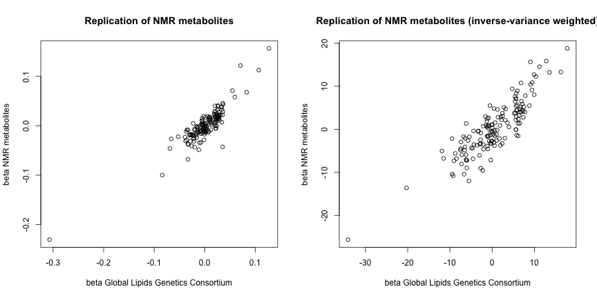
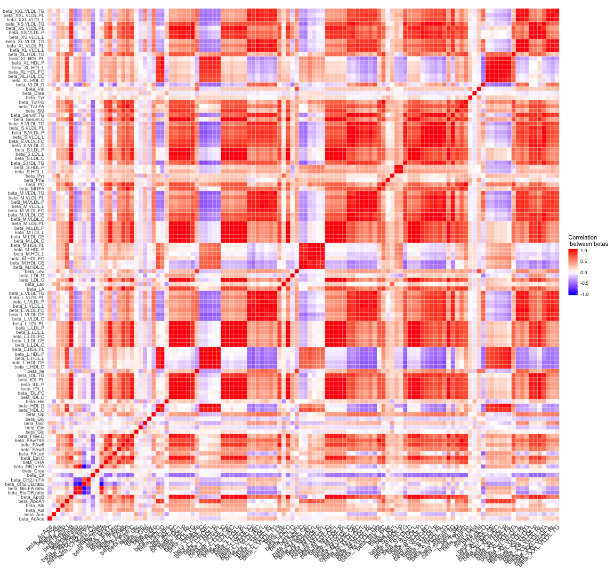

```{r, echo=FALSE,}

suppressWarnings(library(kableExtra))
load("Challenge_dat.RData")


beta_mat <- Challenge_dat[32:149]

```

## Aims

The MR Data Challenge is an opportunity to explore and develop innovative approaches to causal inference using a rich source of genetic association data taken from Kettunen et al (@Kettunen1). Further data publicly available for download from [Computational Medicine](http://www.computationalmedicine.fi/data#NMR_GWAS).

At a glance, these data comprise information on 150 SNPs and their association with

1. 118 lipid fraction traits (including HDL and LDL cholesterol)
2. Health outcomes (including type II Diabetes and stroke)

Researchers attending the upcoming 2019 Mendelian randomization conference in Bristol from July 17th-19th are encouraged to make use of all (or any part) of these data to Illustrate new methodology and to compare or explain existing methods as part of an oral or poster presentation.  

A special conference session is being planned to showcase all of the analyses attempted. Individuals will be encouraged to share software for transparency, with awards being given for innovation and reproducible research.  A key aim of the session will be to bring together methodologists and statisticians with experts from medicine, epidemiology and biological science, who will help to comment on and debate the results.

Further information on the specifics of the data challenge session will be released in the near future, including a set of challenge questions that individuals can choose to address in their analysis.

Please circulate widely among your research group and peers if planning to attend the conference, and encourage them to take part.

We look forward to seeing you in Bristol in the summer. Further information on the MR conference is available at https://www.mendelianrandomization.org.uk/.


## Data description

The data are available as an object `Challenge_dat` within the `MRChallenge2019` package. It includes summary data for the estimated associations between `r dim(beta_mat)[2]` metabolite risk factors and `r dim(beta_mat)[1]` genetic variants, with metabolite information quantified using nuclear magnetic resonance (NMR) spectroscopy metabolomics. The data also includes information on 7 outcomes as described below.

### Genetic instruments

```{r, echo=FALSE}
table_nums <- captioner::captioner(prefix = "Table")
table.1_cap <- table_nums(name = "Table_1", 
                        caption = "Descriptions of variables related to genetic variants")
table.2_cap <- table_nums(name = "Table_2", 
                        caption = "Description of available outcomes")
f.ref <- function(x) {
  stringr::str_extract(table_nums(x), "[^:]*")
}
```

The first 8 columns of `Challenge_dat` contain information on genetic variants associated with at least one of the three major blood lipids in the [Global Lipids Genetics Consortium](http://lipidgenetics.org/) (@GLGC1). These columns are defined in `r f.ref("Table_1")`, with an accompanying sample R output for the first five variants.

```{r, echo=FALSE}

Var.Description<-data.frame(names(Challenge_dat[1:8]))
names(Var.Description)[1]<-"Variable"
Var.Description$Description<-rep("0",8)
Var.Description$Description[1]<-"RSID for genetic variant"
Var.Description$Description[2]<-"The chromosome number for the genetic variant"
Var.Description$Description[3]<-"The position of the genetic variant using Human Genome version 18"
Var.Description$Description[4]<-"The chromosome number and position of the genetic variant using Human Genome version 19"
Var.Description$Description[5]<-"The predicted gene in which the genetic variant lies"
Var.Description$Description[6]<-"The effect allele with respect to association estimates"
Var.Description$Description[7]<-"The other allele with respect to association estimates"
Var.Description$Description[8]<-"The effect allele frequency for the genetic variant"

```

`r table_nums('Table_1')`

``` {r Table1, echo=FALSE, results= 'asis', fig.cap=table.1_cap}
library(knitr)
table1_test<-kable(Var.Description, align=c('c','c'))
kable_styling(table1_test, "striped")


```

```{r}

head(Challenge_dat)[1:8]

```

### Metabolite risk factors

The associations between the `r dim(beta_mat)[1]` genetic variants and `r dim(beta_mat)[2]` lipid risk factors are given in matrix format, using the prefix `beta_`. The corresponding p-value for each association is also provided in a separate matrix, using the prefix `p_`.

```{r}
beta_mat <- Challenge_dat[32:149]

p_mat <- Challenge_dat[150:267]

dim(beta_mat)

```

Using the `colnames()` function we can see the full set of metabolites for which information is available:

```{r}
colnames(beta_mat)
```

For greater interpretability, we can use the annotation of NMR risk factors provided in `NMRA_dat`. This object is a data frame containing the abbreviation, full name, overall heritability of the trait, and classification of the NMR trait. The classification into categories has been done according to the [Nightingale biomarker classification](https://nightingalehealth.com/biomarkers). Risk factor sets named XXX_in are derived from the name of specifc cholesterol measurements, e.g. Total_Cholesterol_in or Free_Cholesterol_in.

For clarification on the abbreviations used, we can compare column names in `beta_mat` with the second column of the `NMRA_dat` data frame:

```{r, echo=FALSE}
load("NMRA_dat.RDATA")
```

```{r}
colnames(beta_mat)[1:5]
NMRA_dat[1:5,2]
```

The set of risk factor categories is also given in the column names of the `NMRA_dat` data frame:

```{r}
colnames(NMRA_dat)[5:ncol(NMRA_dat)]
```

### Outcomes

A total of 7 outcomes are present in the data set. Each outcome is described in `r f.ref("Table_2")` with association estimates and standard errors indicated by the prefixes `beta_` and `se_` respectively.

```{r, echo=FALSE}

Out.Description<-data.frame(c("amd","alz","t2d","isch","las ","ces","svs"))
names(Out.Description)[1]<-"Outcome"
Out.Description$Description<-c("Age-related macular degeneration","Alzheimers's disease","Type 2 diabetes",
                               "Ischemic stroke","Large artery stroke ","Cardioembolic stroke",
                               "Small vessel stroke")
```

`r table_nums('Table_2')`

``` {r Table2, echo=FALSE, results= 'asis', fig.cap=table.2_cap}
library(knitr)
table2_test<-kable(Out.Description, align=c('c','c'))
kable_styling(table2_test, "striped")


```

Data on outcomes was obtained from the [International AMD Genomics](http://amdgenetics.org/) (@AMD1), [DIAGRAM](http://diagram-consortium.org/downloads.html) (@DIAGRAM1), and [MEGASTROKE](http://www.megastroke.org/) (@MEGA1) consortia.

## Useful information

### Instrument strength

It is important to highlight that the strength of association between the genetic variants and the risk factor with which they are most strongly associated differs markedly. As a consequence, not all risk factors have conventionally genetic strong instruments. The minimum p-value for each risk factor across the range of genetic variants is shown below:

```{r}
min_p = apply(p_mat, MARGIN=2,FUN=min)
sort(min_p)
```

### Correlate genetic associations from Global Lipids consortium with NMR metabolites measurements

Using the `Challenge_dat` dataframe it is also possible to compare the associations of the NMR metabolite measurements (.C = Total cholesterol) with the respective associations from the [Global Lipids Genetics Consortium](http://lipidgenetics.org/). Association estimates from the [Global Lipids Genetics Consortium](http://lipidgenetics.org/) are given below, with `beta_`, `se_`, and `_p` again denoting the association estimate, standard error, and p-value where available.

```{r}
head(Challenge_dat[,9:17])
```

As an example, we can compare the associations of the NMR metabolite associations with total HDL cholesterol to those from the [Global Lipids Genetics Consortium](http://lipidgenetics.org/). These are defined as `beta_HDL.C` and  `beta_hdl` respectively. The following code applies inverse variance weighting to the association estimates:

```{r}
beta_hdl_nmr = Challenge_dat$beta_HDL.C
beta_hdl_ivw = Challenge_dat$beta_hdl / Challenge_dat$se_hdl
beta_hdl_nmr_ivw = beta_hdl_nmr / Challenge_dat$se_hdl
```

The raw and inverse variance weighted association estimates can then be plotted for comparison:

```{r,fig.show="hide"}
par(mfrow=c(1,2))
plot(Challenge_dat$beta_hdl,Challenge_dat$beta_HDL.C, main="Replication of NMR metabolites", xlab="beta Global Lipids Genetics Consortium", ylab="beta NMR metabolites")

plot(beta_hdl_ivw, beta_hdl_nmr_ivw, main="Replication of NMR metabolites (inverse-variance weighted)", xlab="beta Global Lipids Genetics Consortium", ylab="beta NMR metabolites")


```



### Correlate genetic associations from Global Lipids consortium with NMR metabolites measurements

The correlation matrix below shows the correlation between the set of NMR metabolites in terms of association estimates.



The correlation matrix above highlights that many of the metabolites are highly correlated with one another. No pruning has been performed on the data presented in `Challenge_dat` or `NMRA_dat`.

##Acknowledgements

The majority of data formatting for this data challenge was provided by Verena Zuber and the Department of Epidemiology and Biostatistics, Imperial College London. Documentation has been adapted by the MRC Integrative Epidemiology Unit, University of Bristol for use in the 2019 MR Conference. The MR Conference will be held at Bristol from July 17th to July 19th, and more information can be found [here](https://www.mendelianrandomization.org.uk/).

##References


